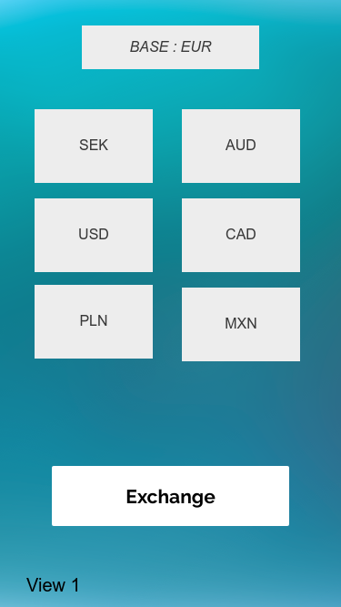
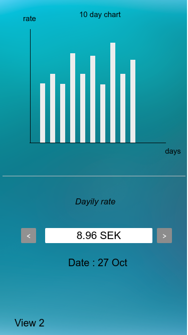
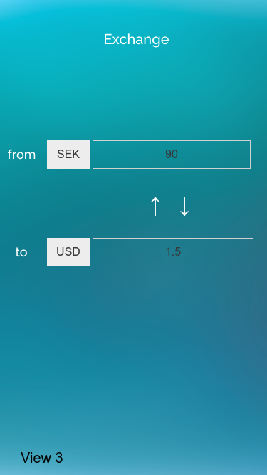

# iOS-Eliq-Challenge

The goal of this challenge is to get diffrent currency rates and show them in different ways with using [Fixer API](https://fixer.io/quickstart). This API allows you to get diffrent currencies based on date. 

The application should have three screens. We have provided 3 wireframes below that should guide the layout of the application but the particular styling is up to you.
 
**View1:**
View1 has 6 buttons of currencies (USD,SEK,AUD,CAD,PLN,MXN).
When user clicks each of them, View2 will be shown.
And also View1 has Exchange button which will open View3.

**View2:**
At top of the View2 we should be able to see the lates 10 days rates as a chart view for the selected currency.
At bottom of the View2 we should be able to see daily rate. User can change the date by clicking the right arrow and left arrow.

_Base currency should be EUR_

**View3:**
In View3 we should be able to convert the currencies to each other locally.
When user clicks on the white buttons , you should show list of currencies to select.(it can be a drop down menu or what ever)

## Guidelines

We suggest you spending maximum 8 hours working on this project.

## End Result

The end result should be an XCode project which contains an iOS application written in Swift. (Pushed on Github)

Writing views programticaly would have extra points.

Good Luck!
